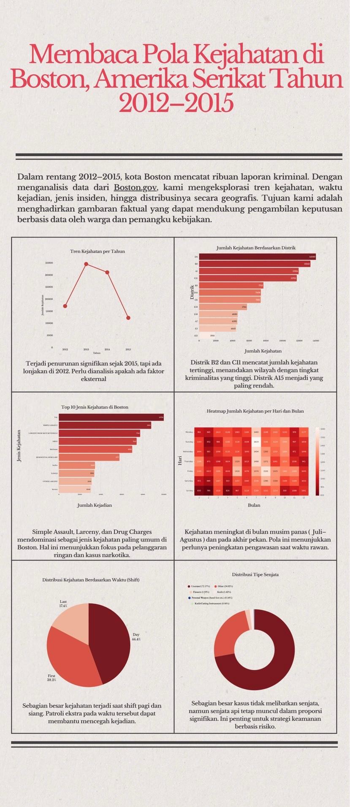

# BostonCrimePatterns

Between 2012 and 2015, the city of Boston recorded tens of thousands of crime incidents, spanning various types and locations. This project aims to analyze publicly available crime data from Boston.gov to uncover patterns and insights that can help in understanding the dynamics of urban crime. Through data cleaning, categorization, and visualization techniques, we examine trends over time, the frequency and distribution of specific crime types, temporal patterns such as peak hours or days, and the spatial spread across neighborhoods.

By presenting this information in a clear and accessible format, the project seeks to empower both policymakers and local communities with factual evidence to support data-driven decision-making. The analysis highlights potential hotspots, recurring crime types, and correlations between time and incident frequency. Ultimately, this study contributes to the broader goal of enhancing public safety awareness and aiding strategic planning for crime prevention and community resilience in Boston.

<h2>📊 Dataset</h2>
- https://data.boston.gov/dataset/crime-incident-reports-july-2012-august-2015-source-legacy-system

<h2>📓 Notebook</h2>
This Jupyter Notebook explores crime data from the city of Boston between 2012 and 2015 using Exploratory Data Analysis (EDA) and data visualization techniques. The dataset, obtained from Boston.gov, includes thousands of reported incidents across different neighborhoods and time periods.

Through data cleaning, preprocessing, and visual exploration (using tools like Pandas, Matplotlib, and Seaborn), we identify crime trends, analyze time-based patterns (hour, day, month), and map out geographic distributions of various types of incidents. This project was conducted as a collaborative group task to develop practical skills in data handling and storytelling with data.

Key Features:
- Data preprocessing and handling of missing values  
- Time-series analysis of crime reports  
- Visualization of crime trends by type, time, and location  
- Heatmaps and bar charts for insight discovery  
- Insights to support data-driven decision-making in public safety

Goal:
To provide a clear, factual overview of crime patterns that could assist policymakers, researchers, and communities in making informed decisions based on real-world data.

👉[Click here to open the BostonCrimePatterns notebook]()

<h2>📷  Screenshots:</h2>

